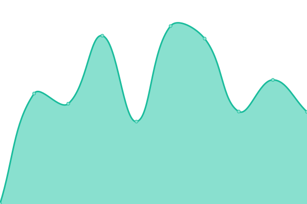

# [📈 Live Status](https://edge20200.github.io/Status): <!--live status--> **🟥 Complete outage**

This repository contains the open-source uptime monitor and status page for [edge20200](https://edge20200.github.io/Status), powered by [Upptime](https://github.com/upptime/upptime).

With [Upptime](https://upptime.js.org), you can get your own unlimited and free uptime monitor and status page, powered entirely by a GitHub repository. We use [Issues](https://github.com/edge20200/Status/issues) as incident reports, [Actions](https://github.com/edge20200/Status/actions) as uptime monitors, and [Pages](https://edge20200.github.io/Status) for the status page.

<!--start: status pages-->
<!-- This summary is generated by Upptime (https://github.com/upptime/upptime) -->
<!-- Do not edit this manually, your changes will be overwritten -->
<!-- prettier-ignore -->
| URL | Status | History | Response Time | Uptime |
| --- | ------ | ------- | ------------- | ------ |
|  OnlyEncodes+ Web - HTTPS | 🟥 Down | [only-encodes-web-https.yml](https://github.com/edge20200/Status/commits/HEAD/history/only-encodes-web-https.yml) | 

 0ms
     
 | 

<a href="https://edge20200.github.io/Status/history/only-encodes-web-https">0.00%</a>
    

|  OnlyEncodes+ Radio | 🟥 Down | [only-encodes-radio.yml](https://github.com/edge20200/Status/commits/HEAD/history/only-encodes-radio.yml) | 

 0ms
     
 | 

<a href="https://edge20200.github.io/Status/history/only-encodes-radio">1.76%</a>
    

|  OnlyEncodes+ IRC | 🟥 Down | [only-encodes-irc.yml](https://github.com/edge20200/Status/commits/HEAD/history/only-encodes-irc.yml) | 

 0ms
     
 | 

<a href="https://edge20200.github.io/Status/history/only-encodes-irc">10.80%</a>
    

<!--end: status pages-->

[**Visit our status website →**](https://edge20200.github.io/Status)

## 📄 License

- Powered by: [Upptime](https://github.com/upptime/upptime)
- Code: [MIT](./LICENSE) © [edge20200](https://edge20200.github.io/Status)
- Data in the `./history` directory: [Open Database License](https://opendatacommons.org/licenses/odbl/1-0/)
